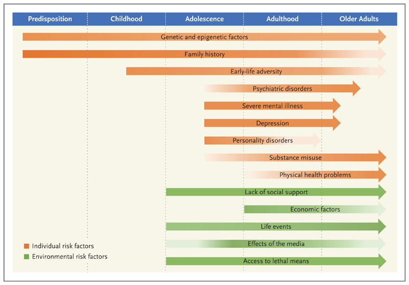

```{r message = FALSE, warning = FALSE}
library(ggplot2) #for plots
library(tidyverse) # general
library(ggalt) # dumbbell plots
library(countrycode) # continent
library(rworldmap) # quick country-level heat maps
library(gridExtra) # plots
library(broom) # significant trends within countries
library(reticulate) #for interacting with Python
library(plotly)
library(ggridges) #for drwaing desnity gradient
library(dplyr)
library(shades) #edit colours in natural ways:
library(bibtex)


#theme_set(theme_light())
library(RefManageR)

```


# **Introduction**
This projects aims at extracting patterns and information from the number of suicides that have occurred through years 1985-2016. 
More precisely, the interested variable is suicide rate, which is the number of suicides that have occured divided by the whole population of the country that each person has committed.
The [suicide rates dataset](https://www.kaggle.com/russellyates88/suicide-rates-overview-1985-to-2016) was pulled from four other datasets linked by time and place, and was built to find signals correlated to increased suicide rates among different cohorts globally, across the socio-economic spectrum. The dataset has the following variables (columns):


<ol>
  <li>Country </li>
  <li>Age </li>
  <li>generation: 4 Age Groups, which are 5-14, 15-24, 25-34, 35-54, 55-74, 75 or older </li>
  <li>count of suicides</li>
  <li>population</li>
  <li>gdp per year</li>
  <li>gdp per capita</li>
</ol>

The sui

## **Suicide**


`r tufte::quote_footer('There is but one truly serious philosophical problem, and that is suicide. Judging whether life is or is not worth living amounts to answering the fundamental question of philosophy. All the rest-- whether or not the world has three dimensions, whether the mind has nine or twelve categories--comes afterwards. Albert Camus')`

So according to this philosopher, suicide is a judgement. Understanding how many people make this judgement and also why and how would they come to this judgement can be enthralling.

Throughout the world, approximately 800,000 people die by suicide every year, accounting for 1.5% of all deaths. Suicide is the tenth leading cause of death in North America and the foremost cause of death worldwide among persons 15 to 24 years of age.
[@suic]

Raising awareness of public about mental health helps in detecting and preventing mental disorders. It would also help in preventing suicide since suicide usually occurs after a major depressive episode. However, suicide can have other reasons, such as substance uses and even it can occur in absence of any psychiatric disorder. Therefore, suicide requires more care and attention, which can be achieved by understanding its influencing factors. 
[@suic] categorizes major factors in the following figure:



All the factors are categorized by age level. This means that age is significant. Moreover, from economic factors in the previous figure, GDP per capita can be regarded as one of the main ones. GDP per Captia is one of the income quality metrics which measure the distribution of income between rich and poor.
We aim at providing insights on effect of age, continent, and Gross Domestic Product (GDP) per capita on suicide rates, which are presented in the sections [Age Analysis](#age), [Continent Gradient](#continent), and [GDP Animation](#gdp). We also provide two hypothesis tests to draw conclusions on data.


  
   


## **Importing and Cleaning**

I added a continent column to the data so as to u
```{r message = FALSE, warning = FALSE}

# 1) Import

data <- read_csv("dataset/master.csv") 
# rename columns

data <- data %>% 
  select(-c(`HDI for year`)) %>%
  rename(gdp_for_year = `gdp_for_year ($)`,
         suicide_rates = `suicides/100k pop`,
         gdp_per_capita = `gdp_per_capita ($)`, 
         country_year = `country-year`) %>%
  as.data.frame()

#colnames(data)
#glimpse(data)
```


```{r message = FALSE, warning = FALSE}

data <- data %>%
mutate(suicide_rates = (as.numeric(suicides_no) / as.numeric(population)) * 100000) #%>%
#relocate(starts_with("suicides_rates"))

data_us <- data %>%
  filter (country == 'United States')# %>%

global_average2 <- sum(data$suicide_rates)

global_average <- (sum(as.numeric(data$suicides_no)) / sum(as.numeric(data$population))) * 100000

```


# Three Major Plots 

## Age Analysis {#age}
As seen in the diagram of influencing factors, age played an important role in suicide. In the following plot, we draw to diagrams side by side. 


```{r message = FALSE, warning = FALSE}
# getting continent data:
data$continent <- countrycode(sourcevar = data[, "country"],
                              origin = "country.name",
                              destination = "continent")

continent <- data %>%
  group_by(continent) %>%
  summarize(suicide_rates = (sum(as.numeric(suicides_no)) / sum(as.numeric(population))) * 100000) %>%
  arrange(suicide_rates)

continent$continent <- factor(continent$continent, ordered = T, levels = continent$continent)

continent_plot <- ggplot(continent, aes(x = continent, y = suicide_rates, fill = continent)) + 
  geom_bar(stat = "identity") + 
  labs(title = "Global Suicide Rates, by Continent",
  x = "Continent", 
  y = "Suicide Rates", 
  fill = "Continent") +
  theme(legend.position = "none",
        title = element_text(size = 10),
        #plot.background = element_blank(),
        panel.grid.major = element_blank(),
        panel.grid.minor = element_blank(),
        #panel.border = element_blank()
        ) + 
  scale_y_continuous(breaks = seq(0, 20, 1), minor_breaks = F)


continent_time <- data %>%
  group_by(year, continent) %>%
  summarize(suicide_per_100k = (sum(as.numeric(suicides_no)) / sum(as.numeric(population))) * 100000)

continent_time$continent <- factor(continent_time$continent, ordered = T, levels = continent$continent)
```


The left one is the global ages which are obtained by summing all suicide rates over all other variables (country, year, etc.).
The right diagram depicts the trend of suicide rates for all age groups over years. 

Both left and right diagrams have age groups as a shared vertical column.

It can be observed from left diagram that suicide rates increase as ages increase. To test this observation and validate it, a hypothesis test is conducted in the section [Hypothesis Tests](#ht)


```{r}
#data$age = 
#as.numeric(gsub("([0-9+]+).*$", "\\1", data$age))

data$age = str_extract(data$age, "[\\d-+]*")

data$age = str_replace_all(data$age, "5-14", "05-14")
```


```{r}
# Make the palette 1 set darker
df <- data.frame(x=1:8, y=1, col=letters[1:8])

# Construct the plot
g <- ggplot(df, aes(x=x, y=y, color=col)) + geom_point(size=5) +
  #scale_fill_brewer(palette="1")
  scale_colour_brewer(palette="Blues")

#g
# Retrieve the color
#colors <- ggplot_build(g)$data[[1]]$colour

# Double check
#plot(df$x, df$y, col=colors, pch=20, cex=5)


# Retrieve the color
colors <- ggplot_build(g)$data[[1]]$colour

# Double check
#plot(df$x, df$y, col=colors, pch=20, cex=5)

#colors
```


```{r message = FALSE, warning = FALSE}
age_plot<- data %>%
  group_by(age) %>%
  summarize(suicide_rates = (sum(as.numeric(suicides_no)) / sum(as.numeric(population))) * 100000) %>%
  ggplot(aes(x = rev(age),
             y = suicide_rates,
             fill = age,
             #position_stack(reverse = TRUE))) + 
  )) +
  geom_bar(stat = "identity") + 
  labs(title = "Global suicide Rates per Age",
       x = "Age", 
       y = "Suicide Rates") +
  theme(legend.position = "none",
        #plot.background = element_blank(),
        panel.grid.major = element_blank(),
        panel.grid.minor = element_blank(),
        axis.title.y = element_blank(),
        axis.text.y = element_blank(), 
        axis.ticks.y = element_blank()
        #axis.title.y = element_blank()
        #axis.text.y  = element_text( hjust=0)
        #panel.border = element_blank()
        ) + 
  scale_y_continuous(breaks = seq(0, 30, 3), minor_breaks = F) +
  scale_y_reverse() +
  #scale_x_discrete(position = "top") +
  #scale_fill_brewer(palette = "Blues") +
  scale_fill_manual(values = brightness(colors, 0.87)) +
  coord_flip()

### with time
age_time_plot <- data %>%
  group_by(year, age) %>%
  summarize(suicide_rates = (sum(as.numeric(suicides_no)) / sum(as.numeric(population))) * 100000) %>%
  ggplot(aes(x = year,
             y = suicide_rates,
             col = age)) + 
  facet_grid(age ~ .,
             scales = "free_y", switch="both") + 
  geom_line() + 
  geom_point() + 
  labs(title = "Suicide rates over years for age groups", 
       x = "Year", 
       y = "Suicide Rates", 
       color = "Age") + 
  theme(legend.position = "none",
        #plot.background = element_blank(),
        panel.grid.major.y = element_blank(),
        panel.grid.minor = element_blank(),
        #axis.text.y  = element_text( hjust=0),
        #strip.background = element_blank(),
        #strip.text.x = element_blank(),
        axis.title.y = element_blank(),
        strip.text.y.left = element_text(angle = 0, margin = margin (0,0,0,0))
        #axis.text.y = element_text(color="red", margin = margin(40,40,40,40)),
        #axis.ticks.margin=unit(c(16,16),'cm')
        #axis.text.y.right = element_text(margin = unit(c(5, 5, 5, 10), "mm"))
        #panel.border = element_blank())
        ) + 
  scale_x_continuous(breaks = seq(1985, 2015, 5), 
                     minor_breaks = F) +
 #scale_colour_brewer(palette = "Blues")
  scale_colour_manual(values = brightness(colors, 0.87)) +
#+ #+ +
  #facet_wrap(~age, scales = "free_x") +
  scale_y_continuous(position = "right")

gt1 <- ggplotGrob(age_plot)
gt2 <- ggplotGrob(age_time_plot)

#grid.arrange(age_plot, age_time_plot, ncol = 2)
#newWidth = unit.pmax(gt1$widths[2:3], gt2$widths[2:3])

#gt1$widths[2:3] = as.list(newWidth)
#gt2$widths[2:3] = as.list(newWidth)

grid.arrange(gt1, gt2, ncol=2)
```


## Continent Gradient {#continent}
Detecting the density of suicide rates for each continent can be enthralling.
For this purpose, this density is provided in the following plot.

```{r message = FALSE, warning = FALSE}
#ggplot(df, aes(x = depth, y = color, fill = stat(x))) +
#  geom_density_ridges_gradient() +
#  scale_fill_viridis_c(name = "Depth", option = "C") +
#  coord_cartesian(clip = "off") + # To avoid cut off
#  theme_minimal()
#ggplotly(p)


#continent <- data %>%
#  group_by(continent, year) %>%
#  summarize(suicide_rates = #(sum(as.numeric(suicides_no))/sum(as.numeric(population))) * 100000) %>%
#  arrange(suicide_rates)

continent <- data %>%
  group_by(continent, age, sex) %>%
  summarize(n = n(), 
            suicides = sum(as.numeric(suicides_no)), 
            population = sum(as.numeric(population)), 
            suicide_rates = (suicides / population) * 100000) 
```


```{r message = FALSE, warning = FALSE}
country_year <- data %>%
  group_by(country, year) %>%
  summarize(suicides = sum(suicides_no), 
            population = sum(population), 
            suicide_rates = (suicides / population) * 100000, 
            gdp_per_capita = mean(gdp_per_capita))


country_year_trends <- country_year %>%
  ungroup() %>%
  nest(-country) %>% # format: country, rest of data (in list column)
  mutate(model = map(data, ~ lm(suicide_rates ~ year, data = .)), # for each item in 'data', fit a linear model
         tidied = map(model, tidy)) %>% # tidy each of these into dataframe format - call this list 'tidied'
  unnest(tidied)

country_year_sig_trends <- country_year_trends %>%
  filter(term == "year") %>%
  mutate(p.adjusted = p.adjust(p.value, method = "holm")) %>%
  filter(p.adjusted < .05) %>%
  arrange(estimate)

country_year_sig_trends$country <- factor(country_year_sig_trends$country, 
                                          ordered = T, 
                                          levels = country_year_sig_trends$country)

```


```{r message = FALSE, warning = FALSE}

#data
```


```{r message = FALSE, warning = FALSE}

data %>%
  group_by(continent, year) %>% 
  summarize(n = n(), 
            suicides = sum(as.numeric(suicides_no)), 
            population = sum(as.numeric(population)), 
            suicide_rates = (suicides / population) * 100000) %>%
  ggplot(aes(x = suicide_rates, y  = continent, fill = stat(x))) +
    geom_density_ridges_gradient() +
    scale_fill_viridis_c(name = "Rate", option = "mako") +
    coord_cartesian(clip = "off") + # To avoid cut off
    theme_minimal() 


```


We observe that the density has higher values in the continents Europe, Oceania, and Asia. Moreover, suicide rates of values greater than 20 are more probable in Europe than other continents.

In order to understand the role of continent and age together, the following plot is provided.


```{r message = FALSE, warning = FALSE}
data %>%
  group_by(continent, age) %>%
  summarize(n = n(), 
            suicides = sum(as.numeric(suicides_no)), 
            population = sum(as.numeric(population)), 
            suicide_rates = (suicides / population) * 100000) %>%
  ggplot(aes(x = continent, y = suicide_rates, fill = age)) + 
  geom_bar(stat = "identity", position = "dodge") + 
  geom_hline(yintercept = global_average, linetype = 2, color = "grey35", size = 1) +
  labs(title = "Age Groups per Continent",
       x = "Continent", 
       y = "Suicide Rates", 
       fill = "Age") +
  theme(
        plot.background = element_blank(),
        panel.grid.major = element_blank(),
        panel.grid.minor = element_blank()#,
        #panel.border = element_blank()
        ) + 
   #scale_fill_brewer(palette = "Blues") #+
  scale_fill_manual(values = brightness(colors, 0.87)) +
  coord_flip()
```


The plot is in agreement with the previous one since only the continents Oceania, Europe, and Asia have suicide rates that are higher than mean for all age groups. It can also be observed that the continent that has most suicide rates for people greater than 75 years old (which usually have the highest rate) is Asia. Asia has the highest diversity of suicide rates among different age groups.
Africa has the least suicide rates among other continents, which can be either the truth or stems from lack of proper information spread in there.


## GDP Animation {#gdp}

Observing the role of GDP per capita and continent together would be enthralling. It would be more insightful to observe the dynamic of this role over years. Hence, the following animation is provided which shows how suicide rates change for each continent over years.

```{r message = FALSE, warning = FALSE}

continent_time_gdp <- data %>%
  group_by(year, continent) %>%
  summarize(suicide_rates = (sum(as.numeric(suicides_no)) / sum(as.numeric(population))) * 100000, gdp_per_capita = mean(as.numeric(gdp_per_capita)), population = sum(as.numeric(population)))

#continent_time_gdp$continent <- factor(continent_time$continent, ordered = T, levels = continent$continent)
```


```{r message = FALSE, warning = FALSE}
p <- ggplot(continent_time_gdp, aes(gdp_per_capita, suicide_rates, color = continent, size= population)) +
  geom_point(aes(frame = year)) +
  scale_x_log10()

ggplotly(p)
```


## Hypothesis Tests (Python) {#ht}

```{python}
#imports
import pandas as pd
import numpy as np
from scipy.stats import norm, skew, sem, t, ttest_rel
import statistics
import math
import matplotlib.pyplot as plt
import seaborn as sns
```


```{python}
#I used guides from 
#https://cran.r-project.org/web/packages/reticulate/vignettes/r_markdown.html
#The project uses my local python virtual environment, in which I have installed the required packages for the python implementations.


df = pd.read_csv("dataset/master.csv") 
df.rename(columns={"suicides/100k pop":"suicide_rates","HDI for year":"HDI_for_year", " gdp_for_year ($) ":"gdp_for_year"," gdp_per_capita ($) ":"gdp_per_capita", "gdp_per_capita ($)":"gdp_per_capita"}, inplace=True)
SuicideData = df.copy()
```

### Men VS Women

In order to test which gender commits more suicides, or to put it differently, which gender has more suicide rate, the whole population of committed people is grouped by males and females. The mean of males are denoted by $mu_{M}$ and that of females by $mu_{F}$ . We find our answer by conducting the following tests:

\(H_{0}:\mu_{M}\leq\mu_{F}\) \hspace{0.5cm} against \hspace{0.5cm} \(H_{1}:\mu_{M}>\mu_{F}\)


```{python}
males=SuicideData[SuicideData.sex=='male']
females=SuicideData[SuicideData.sex=='female']

smp1 = males['suicide_rates']
smp2 = females['suicide_rates']
smp1 = smp1.reset_index(drop=True)
smp2 = smp2.reset_index(drop=True)

n1 = smp1.shape[0]
n2 = smp2.shape[0]

# function for calculating the t-test for two independent samples
def independent_ttest(data1, data2, alpha):
	n1 = len(data1)
	n2 = len(data2)
	# calculate means
	mean1, mean2 = np.mean(data1), np.mean(data2)
	# calculate standard deviation of samples
	std1, std2 = np.std(smp1, ddof=1), np.std(smp2, ddof=1)
	se1, se2 = std1/math.sqrt(n1), std2/math.sqrt(n2)
	# standard error on the difference between the samples
	s_t = math.sqrt(se1**2.0 + se2**2.0)
	# calculate the t statistic
	t_stat = (mean1 - mean2) 
	# degrees of freedom
	df = len(data1) + len(data2) - 2
	# calculate the critical value
	t_alpha = t.ppf(1.0 - alpha, df)
	# calculate the p-value
	#p = (1.0 - t.cdf(abs(t_stat), df)) * 2.0
	u = t_alpha * s_t
	# return everything
	return t_stat, u
independent_ttest(smp1,smp2 ,0.05)

grouop_data=df.groupby(['age','sex'])['suicides_no'].sum().unstack()
grouop_data=grouop_data.reset_index().melt(id_vars='age')
grouop_data_female=grouop_data.iloc[:6,:]
grouop_data_male=grouop_data.iloc[6:,:]
#print(grouop_data_female)
#grouop_data_male
```
Since the test statistic $T(X) = 14.76$ is greater than the critical value $u = 0.35$, we'll reject the null hypothesis and increase our confidence in $H_1$, concluding that mean of males is greater than females.


### Youth vs Elderly

In order to test which age group commits more suicide rates, or to put it differently, which age group has more suicide rate, we will divide the whole population of committed people into two groups, one with ages  between 5-54 years old, and another with ages greater that 55 years old.
If we denote the mean of youth by 
$mu_{Y}$ and that of the elderly by $mu_{E}$. We find our answer by conducting the following tests:

\(H_{0}:\mu_{E}\leq\mu_{Y}\) \hspace{0.5cm} against \hspace{0.5cm} \(H_{1}:\mu_{E}>\mu_{Y}\)


```{python}
youth = SuicideData[SuicideData.age.isin(['5-14 years', '15-24 years', '25-34 years', '35-54 years'])]
elder = SuicideData[~SuicideData.age.isin(['5-14 years', '15-24 years', '25-34 years', '35-54 years'])]

smp1 = elder['suicide_rates']
smp2 = youth['suicide_rates']
smp1 = smp1.reset_index(drop=True)
smp2 = smp2.reset_index(drop=True)

n1 = smp1.shape[0]
n2 = smp2.shape[0]

independent_ttest(smp1, smp2, 0.05)
```  

Since the test statistic $T(X) = 10.9$ is greater than the critical value $u = 0.47$, we'll reject the null hypothesis and increase our confidence in $H_1$, concluding that mean of elderly is greater than youth.

# Conclusion

Based on the plots and tests, we concluded that elderly people have higher suicide rates than youth. Moreover, the continents Oceania, Europe, and Asia have the higher rates than other counties, with Europe having the highest density. 

This study can be extended in various ways. One can go from continents to countries and visualize the suicide rates and draw conclusions based on countries. Moreover, the dataset lacks the reason of suicide. If the reason would be also recorded, then understanding suicide and preventing it would be much more effective.


# References

<div id="refs"></div>